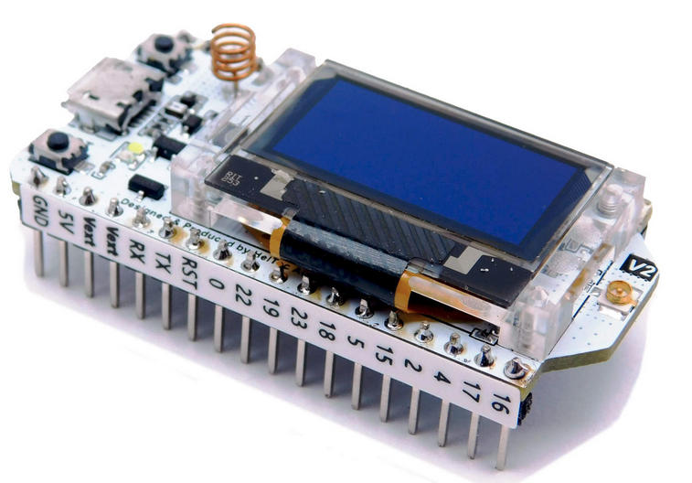

# Low Power IoT Architectures
This repository contains the material for teaching low power IoT Architectures with ESP32 based board - HELTEC WiFi - LoRa.
The ESP32 SoC integrates WiFi and BT modems. The external SX1276 LoRa modem allows for Long Range communication with IoT terminals.

## The board
<picture>
 
</picture>

## The teaching material includes:

1 hour presentation

6 3-hour laboratories 

Coding examples

## Attention
The main document is protected by an 18 digit code; t is not modifiable or copiable.

The codes contain intentionally introduced errors.
You must analyze them closly and compare with the original codes in the main document.

